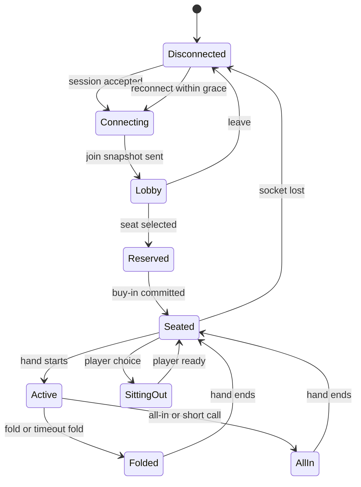

# State Machines

## Room State Machine
| State | Trigger | Next State | Notes |
| --- | --- | --- | --- |
| `ROOM_CREATED` | room bootstrap succeeds | `ROOM_OPEN` | room code minted, admin snapshot ready |
| `ROOM_OPEN` | enough ready players | `HAND_PREP` | minimum 2 seated eligible players |
| `HAND_PREP` | blinds/antes posted and cards dealt | `BETTING_PREFLOP` | state written before cards fan out |
| `BETTING_PREFLOP` | betting round complete | `FLOP_DEAL` | may skip if everyone all-in or folded |
| `FLOP_DEAL` | board dealt | `BETTING_FLOP` | public snapshot update |
| `BETTING_FLOP` | betting round complete | `TURN_DEAL` | same skip rules |
| `TURN_DEAL` | board dealt | `BETTING_TURN` | n/a |
| `BETTING_TURN` | betting round complete | `RIVER_DEAL` | n/a |
| `RIVER_DEAL` | board dealt | `BETTING_RIVER` | n/a |
| `BETTING_RIVER` | round complete | `SHOWDOWN_PREP` | or direct award if one player remains |
| `SHOWDOWN_PREP` | hand ranks resolved | `SETTLEMENT` | all pots resolved here |
| `SETTLEMENT` | ledger + audit committed | `BETWEEN_HANDS` | admin edits/top-ups allowed |
| `BETWEEN_HANDS` | next hand start | `HAND_PREP` | button advances |
| any active | admin pause or recovery fault | `ROOM_PAUSED` | no new actions accepted |
| `ROOM_PAUSED` | admin resume | prior state | restore the persisted turn deadline by adding only the unconsumed timer remainder |
| any | admin close room or max-duration reached | `ROOM_CLOSED` | no new joins |
| `ROOM_CLOSED` | session summary derived | `SESSION_SUMMARY` | settle-up is now available |

## Player Connection State

## Turn Timer State
| State | Entry | Exit |
| --- | --- | --- |
| `IDLE` | no active turn | on `TURN_STARTED` |
| `RUNNING` | countdown visible | on action, timeout, pause, or reconnect safe-stop |
| `WARNING` | 5 seconds remaining | on action or expiry |
| `EXPIRED` | auto action chosen | immediately transitions to `RESOLVED` |
| `RESOLVED` | action committed | back to `IDLE` |

## Reconnect Safe-Stop Rule
- A reconnect safe-stop means the server may temporarily stop decrementing the visible turn timer only when the room is already entering `ROOM_PAUSED` or deterministic recovery handling.
- Ordinary player disconnects do not pause the hand or grant extra turn time.
- Any paused timer must resume from persisted remaining time rather than resetting to the full action duration.

## Settlement Finality State
| State | Meaning |
| --- | --- |
| `UNSTARTED` | betting not yet complete |
| `POTS_BUILT` | contributions frozen and pots constructed |
| `WINNERS_RESOLVED` | winning sets computed per pot |
| `LEDGER_COMMITTED` | payouts written transactionally |
| `AUDIT_EMITTED` | transcripts and public results emitted |
| `FINAL` | hand immutable except compensating admin adjustment |
