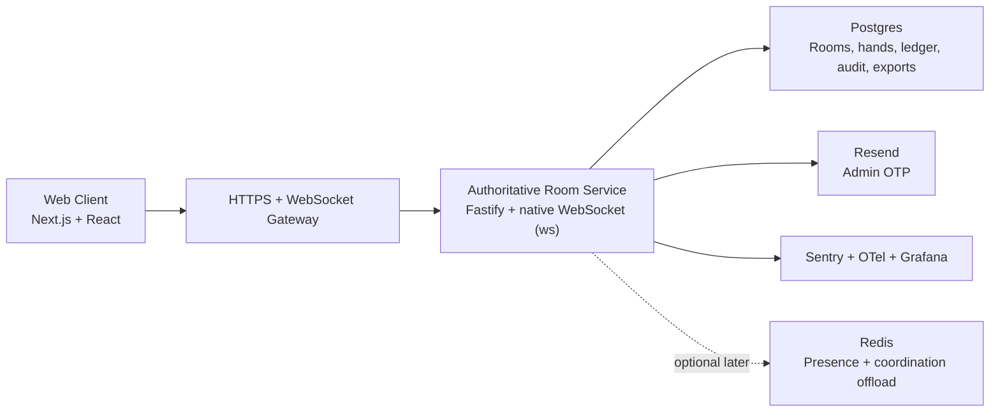

# System Overview

## Architectural Style
- Server-authoritative realtime application with room-scoped actors.
- Monorepo with thin apps and rich shared packages.
- Single writer per room to guarantee deterministic action ordering and settlement.
- Append-only audit and ledger records for all financially meaningful events.

## Context Diagram

## Source Of Truth By Concern
| Concern | Owner |
| --- | --- |
| Room config | Server + Postgres |
| Seat reservations | Room actor |
| Turn order and action legality | Room actor + game engine |
| Shuffle and deal | Game engine invoked by room actor |
| Settlement | Game engine + transactional persistence layer |
| Ledger balance | Postgres append-only ledger + derived balance view |
| Client rendering state | Web client, derived from server snapshots and diffs |

## Request Categories
| Path | Transport | Authority | Notes |
| --- | --- | --- | --- |
| Auth and room CRUD | HTTPS | Server | Idempotent request/response |
| Live play | WebSocket | Server | Client submits intents only |
| History export | HTTPS | Server | Async export job optional later |
| Presence and reconnect | WebSocket | Server | v1 uses server snapshots; Redis coordination is optional later |

## Primary Flows
- Create room: admin auth -> config validation -> room persisted -> room actor primed -> room code returned.
- Join room: guest session validated -> lobby snapshot returned -> optional websocket subscription.
- Act in hand: intent received -> dedupe/idempotency check -> legality check -> state transition -> persist -> broadcast diff.
- Settle hand: contributions frozen -> pots built -> winners resolved -> ledger + settlement committed -> room advanced.

## Design Constraints
- No client authority for actions, timers, shuffle, deal, or settlement.
- No optimistic chip accounting on the client.
- Contract payloads validated on ingress and egress.
- Hidden cards never exist in spectator payloads before showdown.
- Room configuration edits apply only between hands.
