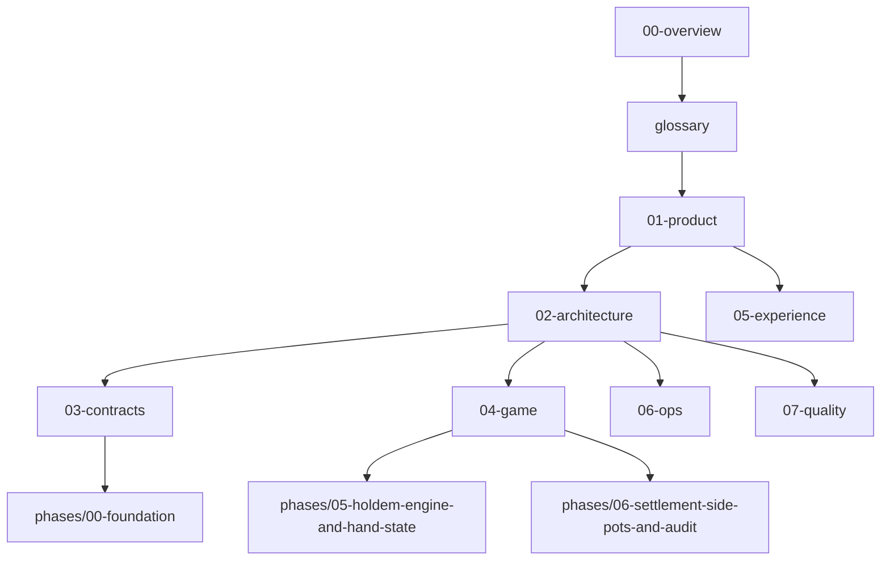

# PotLuck Docs Index

## Intent
- This folder is the implementation pack for PotLuck.
- It is written for AI-assisted execution: concise, technical, decision-complete, and phase-oriented.
- If a phase doc conflicts with an authoritative doc, update the authoritative doc first or record an ADR.

## Reading Order
1. `00-overview.md`
2. `glossary.md`
3. `01-product/*`
4. `02-architecture/*`
5. `03-contracts/*`
6. `04-game/*`
7. `05-experience/*`
8. `06-ops/*`
9. `07-quality/*`
10. `phases/00-foundation/*`

## Do Not Implement Before Reading
- `02-architecture/system-overview.md`
- `02-architecture/state-machines.md`
- `03-contracts/realtime-events.md`
- `04-game/settlement-spec.md`
- `05-experience/screen-specs.md`
- `phases/00-foundation/implementation.md`

## Dependency Graph

## Phase Execution Order
| Phase | Name | Goal | AI Mode | Comment |
| --- | --- | --- | --- | --- |
| 00 | Foundation | Create monorepo scaffold, CI, env handling, baseline tooling | `med` | `med`, leaning `hi`; use `hi` if one pass is wiring the full workspace and CI together |
| 01 | Auth Admin and Guest Entry | Establish identity, roles, and room entry | `hi` | `hi`, leaning `med`, but safe-side `hi` because auth mistakes become security bugs |
| 02 | Room Lobby Seating | Build room creation, codes, seating, and lobby flows | `med` | `med`, leaning `hi`; product-state heavy, but still simpler than realtime hand logic |
| 03 | Wallet Buyin and Ledger | Enforce room-scoped chips and table-stakes accounting | `hi` | `hi`, leaning `xtra hi`; chip accounting and rollback safety need careful reasoning |
| 04 | Realtime Room Actor | Implement single-writer room loop and action transport | `xtra hi` | `xtra hi`; event ordering, reconnects, timers, and idempotency are subtle |
| 05 | Holdem Engine and Hand State | Build the authoritative hand state machine | `xtra hi` | `xtra hi`; betting legality and street transitions have many edge cases |
| 06 | Settlement Side Pots and Audit | Finalize pot splitting, side pots, and auditable payouts | `xtra hi` | `xtra hi`, and stay there; this is the highest-risk correctness phase |
| 07 | Player Table UI | Ship the mobile-first player interface | `hi` | `hi`, leaning `med`; UI work is lighter than engine work, but contract accuracy still matters |
| 08 | Admin And History | Add moderation and hand history; spectator work is now future scope | `hi` | `hi`, leaning `med`; permission edges and export safety still make `hi` safer |
| 09 | Hardening Load Release | Prove reliability, accessibility, and release readiness | `hi` | `hi`, leaning `xtra hi`; release, soak, and observability decisions are operationally risky |

## Current Status
- Repo status: executable monorepo with implementation through `phases/09-hardening-load-release/`.
- Current implementation checkpoint: release hardening, restart recovery rehearsal, observability metrics, and synthetic soak coverage are in place.
- Branch naming convention: `codex/<task-name>`.
