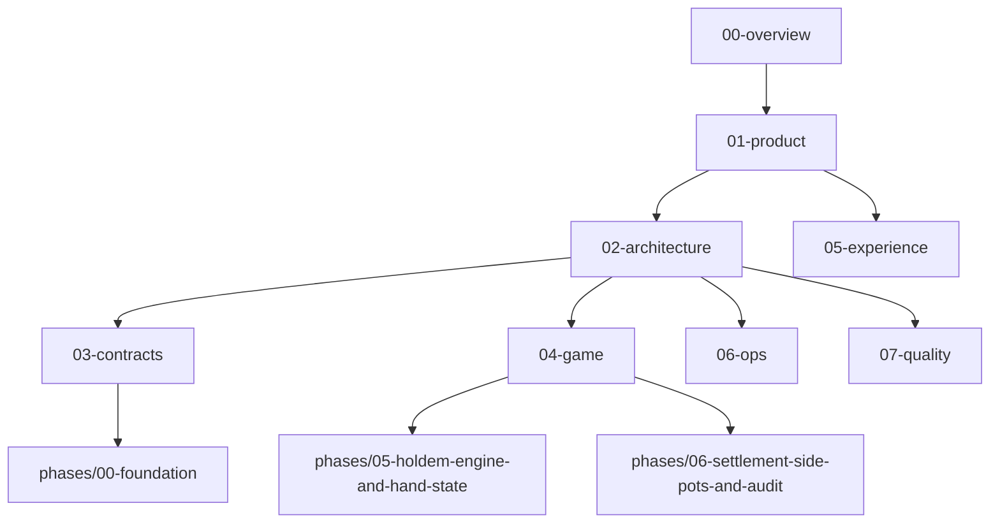

# PotLuck Docs Index

## Intent
- This folder is the implementation pack for PotLuck.
- It is written for AI-assisted execution: concise, technical, decision-complete, and phase-oriented.
- If a phase doc conflicts with an authoritative doc, update the authoritative doc first or record an ADR.

## Reading Order
1. `00-overview.md`
2. `01-product/*`
3. `02-architecture/*`
4. `03-contracts/*`
5. `04-game/*`
6. `05-experience/*`
7. `06-ops/*`
8. `07-quality/*`
9. `phases/00-foundation/*`

## Do Not Implement Before Reading
- `02-architecture/system-overview.md`
- `02-architecture/state-machines.md`
- `03-contracts/realtime-events.md`
- `04-game/settlement-spec.md`
- `05-experience/screen-specs.md`
- `phases/00-foundation/implementation.md`

## Dependency Graph

## Phase Execution Order
| Phase | Name | Goal |
| --- | --- | --- |
| 00 | Foundation | Create monorepo scaffold, CI, env handling, baseline tooling |
| 01 | Auth Admin and Guest Entry | Establish identity, roles, and room entry |
| 02 | Room Lobby Seating | Build room creation, codes, seating, and lobby flows |
| 03 | Wallet Buyin and Ledger | Enforce room-scoped chips and table-stakes accounting |
| 04 | Realtime Room Actor | Implement single-writer room loop and action transport |
| 05 | Holdem Engine and Hand State | Build the authoritative hand state machine |
| 06 | Settlement Side Pots and Audit | Finalize pot splitting, side pots, and auditable payouts |
| 07 | Player Table UI | Ship the mobile-first player interface |
| 08 | Admin Spectator History | Add moderation, spectating, and hand history |
| 09 | Hardening Load Release | Prove reliability, accessibility, and release readiness |

## Current Status
- Repo status: docs scaffolded, no executable code yet.
- Current implementation starting point: `phases/00-foundation/`.
- Branch naming convention: `codex/<task-name>`.
